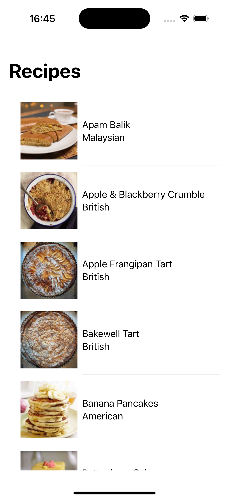
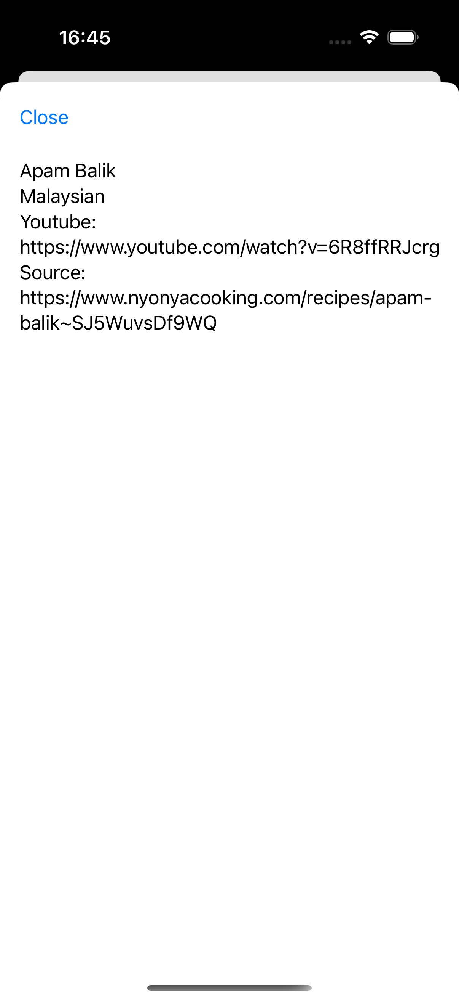

# FetchRecipe
An app that gives you picture of recipes and links for you to copy to your browsers to read.(Dark mode supported) 
See built DocC in [RecipeLibrary](RecipeLibrary/Sources/RecipeLibrary/RecipeLibrary.docc)

 
 

